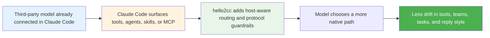

# hello2cc

[](https://www.npmjs.com/package/hello2cc)
[](./LICENSE)
[](https://github.com/hellowind777/hello2cc/actions/workflows/publish.yml)

Make third-party models inside Claude Code behave closer to a native Opus session.

`hello2cc` does not replace your gateway, provider mapping, or account setup.  
It sits in the plugin layer and keeps third-party models closer to Claude Code's native behavior around tool choice, agent routing, task and team workflow, failure handling, and response style.

**Language:** English | [简体中文](./README_CN.md)

## Overview

`hello2cc` is for users who already run GPT, Kimi, DeepSeek, Gemini, Qwen, or other third-party models in Claude Code through CCSwitch or a similar mapping layer.

It helps in three places:

- keep capability selection closer to Claude Code's native priorities
- reduce routing mistakes around plain agents, teams, tasks, and follow-up workflow
- tighten response behavior so replies stay more direct, restrained, and execution-first

### Best for

- Claude Code sessions already connected to third-party models
- repositories that expose skills, workflows, MCP resources, or plugins
- users who want fewer detours and less prompt-shape sensitivity

### Not for

- setting up API keys, providers, or model gateways
- exposing tools that Claude Code itself did not surface
- replacing CCSwitch or another provider-mapping layer
- overriding repository rules such as `AGENTS.md`, `CLAUDE.md`, or direct user instructions

## What's new in 0.5.11

Compared with the previous public release (`v0.5.9`), `0.5.11` adds two practical fixes and one behavior tightening pass:

| Area | What changed |
|---|---|
| Task completion | `TaskCompleted` / `TaskUpdate(status=completed)` no longer gets hard-blocked just because the description is thin; the hook now warns without breaking completion-state sync |
| New Claude Code compatibility | The old `Task` subagent tool name is now treated as an alias of `Agent`, covering hooks, capability detection, session continuity, and real-session regression checks |
| Output discipline | Explanation and comparison prompts are less likely to trigger team/task-board demos, and the native style now pushes replies toward concise, direct, low-ceremony wording |

## Features

- **Native-first routing guidance**: keeps the model closer to Claude Code's surfaced capability order instead of falling back to broad keyword-driven choices.
- **Agent and team guardrails**: distinguishes plain workers from real teammate flows, reduces accidental `team_name` pollution, and preserves task-board continuity only when the host proves it exists.
- **Task lifecycle protection**: keeps task creation and task completion checks separate so a completed task is less likely to stay out of sync with the board.
- **Task-to-Agent compatibility**: supports both old and new Claude Code subagent tool names in the same plugin build.
- **Response-style tightening**: reduces over-planning, forced confirmations, tool theater, meta narration, jargon-heavy phrasing, and invitation-style endings.

## Quick Start

### Prerequisites

- Node.js 18 or later
- Claude Code with plugin support
- a working third-party model mapping layer such as CCSwitch, if you are not using native Claude models

### Install

1. Clone the repository.

   ```bash
   git clone https://github.com/hellowind777/hello2cc.git
   cd hello2cc
   ```

2. Add the local marketplace entry.

   ```bash
   claude plugins marketplace add "<repo-path>"
   ```

   Replace `<repo-path>` with your local `hello2cc` repository path.

3. Install and enable the plugin.

   ```bash
   claude plugins install hello2cc@hello2cc-local
   claude plugins enable hello2cc@hello2cc-local
   ```

4. Reload Claude Code.

   ```bash
   /reload-plugins
   ```

### Verify

Run:

```bash
claude plugins list
```

Expected result:

- `hello2cc@hello2cc-local` is installed
- the plugin status is enabled
- new sessions no longer rely on a plugin-shipped `settings.json` to force `agent=hello2cc:native`

## Recommended configuration

### Minimal configuration

Good when your model mapping is already handled elsewhere and you only want hello2cc to align behavior:

```json
{
  "mirror_session_model": true
}
```

### Stable default agent model

Good when you want most spawned agents to use the same explicit model value:

```json
{
  "mirror_session_model": true,
  "default_agent_model": "opus"
}
```

`inherit` still means “do not inject a model”. Any other value is passed through to Claude Code as configured, so keep it aligned with the Agent model values your local setup accepts.

## How it works



### Main behavior layers

| Layer | What it does |
|---|---|
| Host-state guidance | Surfaces tools, agents, workflows, MCP resources, and continuity state so the model chooses within the real session boundary |
| Pre/post tool guardrails | Normalizes inputs, strips placeholders, records failure memory, and keeps deterministic checks fail-closed |
| Native style shell | Keeps replies closer to Claude Code's direct, restrained, execution-first style |

## Troubleshooting

### The plugin seems inactive

Check the following:

1. reload Claude Code or reopen the session
2. confirm the plugin is installed and enabled
3. if you updated a local clone, reinstall it cleanly

### `hello2cc:native` still shows after disable or reload

Claude Code can keep thread-level agent state across resumed sessions.  
Current versions no longer ship a plugin-side `settings.json` that force-selects `hello2cc:native`, so a clean reinstall and a fresh session should stop new unintended injection.

### `TaskCompleted` or `TaskUpdate(status=completed)` still gets stuck

Upgrade to `0.5.11` or later, then reload the plugin.  
Current versions downgrade thin completion descriptions from a hard block to a warning-first guard, so task-board state can still move to completed.

### New Claude Code builds look like `Agent` and `Task` no longer match

Upgrade to `0.5.11` or later.  
hello2cc now treats `Task` as an alias of `Agent` across its internal compatibility surface.

### CCS + sub2api + codex still shows `Team "default" does not exist`

Current versions reduce accidental team injection for explanation, comparison, and capability prompts.  
If the problem remains, inspect the Claude Code debug log first and confirm whether the upstream model or proxy is still emitting a real tool input such as `team_name: "default"` or `name + team_name`.

### Terminal output is still not streaming

This repository does not currently show a plugin-side code path that explicitly disables Claude Code streaming.  
If the issue remains, check:

1. whether `sub2api` buffers streaming responses into a single payload
2. whether your CCS Anthropic endpoint and Responses endpoint both expose true streaming passthrough
3. whether `claude --debug-file <path>` already shows the upstream response arriving as non-streaming

## Documentation

- [Claude Code 重构方案对齐审计](./docs/claude-code-refactor-alignment-audit.md)
- [更新日志](./CHANGELOG.md)

## FAQ

<details>
<summary><strong>Does hello2cc replace CCSwitch?</strong></summary>

No. CCSwitch or another mapping layer should continue to own provider and model mapping. hello2cc only shapes behavior after the model is already running inside Claude Code.

</details>

<details>
<summary><strong>Does it expose tools that Claude Code did not expose?</strong></summary>

No. It only helps the model choose and use capabilities that are already present in the current session.

</details>

<details>
<summary><strong>Do I need to switch an output style manually?</strong></summary>

Usually not. The plugin ships an output style and a native agent option, but normal installation should not require an extra manual entry point.

</details>

<details>
<summary><strong>Does every multi-agent task become a team?</strong></summary>

No. One-shot parallel work can stay on ordinary agent paths. Real team workflow is reserved for cases that need persistent task-board, ownership, or handoff semantics.

</details>

<details>
<summary><strong>Can hello2cc enforce its wording rules over repository instructions?</strong></summary>

No. User instructions, Claude Code host rules, and repository rules still win. hello2cc only tightens the default behavior inside the remaining space.

</details>

## Support

- Issues: https://github.com/hellowind777/hello2cc/issues
- Releases: https://github.com/hellowind777/hello2cc/releases

## License

This repository is licensed under the [Apache-2.0 License](./LICENSE).  
See [LICENSE](./LICENSE) for full details.
