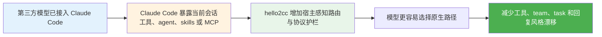

# hello2cc

[](https://www.npmjs.com/package/hello2cc)
[](./LICENSE)
[](https://github.com/hellowind777/hello2cc/actions/workflows/publish.yml)

让 Claude Code 里的第三方模型更接近原生 Opus 会话的行为方式。

`hello2cc` 不负责网关、provider 映射或账号接入。  
它处在插件层，主要把第三方模型往 Claude Code 原生的工具选择、agent 路由、task / team 流程、失败处理和回复风格上继续收紧。

**语言：** [English](./README.md) | 简体中文

## 概览

`hello2cc` 适合已经通过 CCSwitch 或其他映射层，把 GPT、Kimi、DeepSeek、Gemini、Qwen 等第三方模型接进 Claude Code 的用户。

它主要处理三类问题：

- 让能力选择更接近 Claude Code 原生优先级
- 减少 plain agent、team、task、follow-up 工作流上的误路由
- 收紧回复习惯，让输出更直接、更克制、更偏执行

### 适合场景

- 已经在 Claude Code 中运行第三方模型
- 当前仓库暴露了 skills、workflows、MCP 或插件能力
- 希望减少绕路、减少对提示措辞的依赖

### 使用边界

- 不负责 API key、provider、gateway 接入
- 不会替 Claude Code 打开原本不存在的工具
- 不替代 CCSwitch 或其他模型映射层
- 不覆盖仓库里的 `AGENTS.md`、`CLAUDE.md` 或用户明确指令

## 0.5.11 更新内容

相对上一个公开 release 版本 `v0.5.9`，`0.5.11` 主要补了两类兼容修复和一轮输出纪律收紧：

| 范围 | 变化 |
|---|---|
| 任务完成态 | `TaskCompleted` / `TaskUpdate(status=completed)` 不再因为描述过薄被 hard block；现在改成 warning-first，不再卡住 completed 同步 |
| 新版 Claude Code 兼容 | 旧的 `Task` subagent 工具名现在统一当成 `Agent` 别名处理，覆盖 hooks、能力识别、session continuity 和真实回归 |
| 输出纪律 | 说明类、对比类问题不再容易被升级成 team / task-board 演示；native style 也更明确地约束简洁、直接、少仪式感的表达 |

## 功能特性

- **native-first 路由引导**：尽量把模型拉回 Claude Code 当前已经 surfaced 的能力顺序，而不是走宽泛关键词猜路由。
- **agent / team 护栏**：区分普通 worker 和真实 teammate 流程，减少 `team_name` 污染，只在宿主已经证明存在真实 team 时保留 task-board 连续体。
- **task lifecycle 收口**：把建任务和完结任务的校验边界拆开，避免任务明明做完却因为插件红字卡在 board 里。
- **Task-to-Agent 兼容**：同一个版本里同时兼容旧 `Task` 名称和新 `Agent` 名称。
- **回复风格收紧**：减少过度规划、强制确认、工具表演、元叙述、黑话和邀约式结尾。

## 快速开始

### 前置条件

- Node.js 18 或更高版本
- 支持插件的 Claude Code
- 如果你不是直接使用 Claude 原生模型，需要先有 CCSwitch 或其他可用的模型映射层

### 安装

1. 克隆仓库。

   ```bash
   git clone https://github.com/hellowind777/hello2cc.git
   cd hello2cc
   ```

2. 添加本地 marketplace。

   ```bash
   claude plugins marketplace add "<repo-path>"
   ```

   把 `<repo-path>` 替换成你本地的 `hello2cc` 仓库路径。

3. 安装并启用插件。

   ```bash
   claude plugins install hello2cc@hello2cc-local
   claude plugins enable hello2cc@hello2cc-local
   ```

4. 重新加载 Claude Code。

   ```bash
   /reload-plugins
   ```

### 验证

执行：

```bash
claude plugins list
```

预期结果：

- `hello2cc@hello2cc-local` 已安装
- 插件状态为 enabled
- 新会话不再依赖插件随包 `settings.json` 去强制写入 `agent=hello2cc:native`

## 推荐配置

### 最小配置

适合模型映射已经在别处处理好，只希望 hello2cc 负责行为对齐：

```json
{
  "mirror_session_model": true
}
```

### 固定默认 agent model

适合希望大多数 agent 默认使用同一个显式模型值：

```json
{
  "mirror_session_model": true,
  "default_agent_model": "opus"
}
```

`inherit` 仍表示“不注入 model”。其他值会按配置原样传给 Claude Code，因此需要与你本地 Agent 能接受的 model 值保持一致。

## 工作原理



### 主要行为层

| 层 | 作用 |
|---|---|
| 宿主状态引导 | 把当前会话的 tools、agents、workflows、MCP 和 continuity 状态显式给模型，减少模型在错误边界内乱选 |
| pre/post tool 护栏 | 归一化输入、清理占位值、记录失败记忆，并对确定性错误保持 fail-closed |
| native style 壳层 | 让输出更贴近 Claude Code 默认的直接、克制、执行优先风格 |

## 排错

### 安装后感觉没生效

按这个顺序检查：

1. 重新加载 Claude Code 或重开会话
2. 确认插件已安装并启用
3. 如果你是更新本地克隆仓库后重装，先做一次完整重装

### 禁用插件或 reload 后，`hello2cc:native` 还显示着

Claude Code 可能会保留线程级 agent 状态。  
当前版本已经不再通过插件侧 `settings.json` 强制选中 `hello2cc:native`，所以完整重装并开启新会话后，不应再继续产生新的默认注入。

### `TaskCompleted` 或 `TaskUpdate(status=completed)` 还是被卡住

请升级到 `0.5.11` 或更高版本后重新加载插件。  
当前版本已经把“描述过薄”的完成态校验从 hard block 调整为 warning-first，不再让任务明明完成却卡在 board 里。

### 新版 Claude Code 里 `Agent` 和 `Task` 看起来对不上

请升级到 `0.5.11` 或更高版本。  
hello2cc 现在已经把 `Task` 统一当作 `Agent` 别名处理。

### CCS + sub2api + codex 还会出现 `Team "default" does not exist`

当前版本已经减少 capability / compare / explain 问法下的误注入。  
如果问题还在，优先看 Claude Code debug log，确认是不是上游模型或代理层仍然真的发出了 `team_name: "default"` 或 `name + team_name` 这样的工具输入。

### 终端还是没有流式输出

当前仓库没有发现插件侧主动关闭 Claude Code streaming 的代码路径。  
如果问题还在，优先检查：

1. `sub2api` 是否把流式响应缓冲成整包输出
2. CCS 当前 Anthropic 端点和 Responses 端点是否都真正开启了流式透传
3. `claude --debug-file <path>` 日志里是否已经显示上游返回本身就是非流式

## 文档

- [Claude Code 重构方案对齐审计](./docs/claude-code-refactor-alignment-audit.md)
- [更新日志](./CHANGELOG.md)

## 常见问题

<details>
<summary><strong>hello2cc 会替代 CCSwitch 吗？</strong></summary>

不会。provider 和模型映射仍然应该由 CCSwitch 或其他映射层负责。hello2cc 只处理模型已经进入 Claude Code 之后的行为对齐。

</details>

<details>
<summary><strong>它会替 Claude Code 打开原本没有暴露的工具吗？</strong></summary>

不会。它只能帮助模型更稳定地使用当前会话里已经存在的能力。

</details>

<details>
<summary><strong>还需要手动切 output style 吗？</strong></summary>

通常不需要。插件会提供 output style 和 native agent 选项，但正常安装后不应该要求额外手动入口。

</details>

<details>
<summary><strong>是不是所有多 agent 任务都会变成 team？</strong></summary>

不会。一次性并行任务可以继续走普通 agent。只有真正需要 task-board、owner 或 handoff 的场景才更适合真实 team 流程。

</details>

<details>
<summary><strong>hello2cc 的表述纪律能压过仓库规则吗？</strong></summary>

不能。用户指令、Claude Code 宿主规则、仓库级规则仍然优先。hello2cc 只是在剩余空间里尽量把默认行为收紧到更直接、更克制的风格。

</details>

## 支持

- Issues：https://github.com/hellowind777/hello2cc/issues
- Releases：https://github.com/hellowind777/hello2cc/releases

## 许可证

本项目采用 [Apache-2.0 许可证](./LICENSE)。  
详见 [LICENSE](./LICENSE)。
